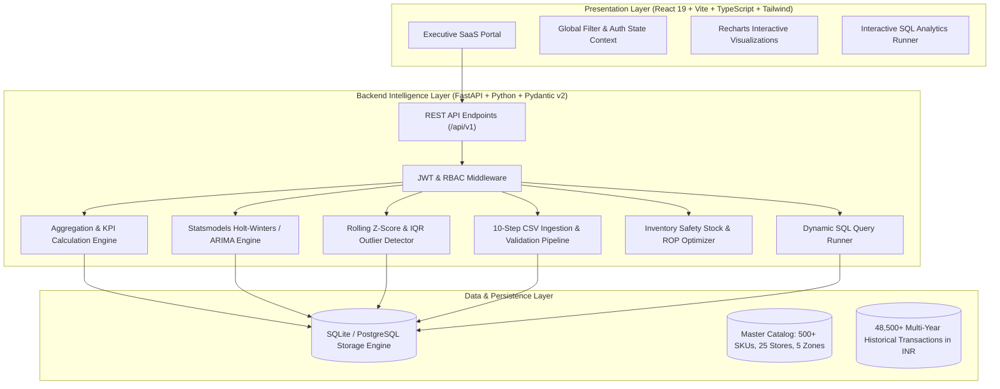

# 🇮🇳 RetailPulse — Enterprise Sales & Demand Intelligence Platform

[](https://fastapi.tiangolo.com)
[](https://reactjs.org)
[](https://www.typescriptlang.org)
[](https://tailwindcss.com)
[](https://www.python.org)
[](LICENSE)

> **RetailPulse** is an enterprise-grade **Sales & Demand Intelligence Platform** engineered for multi-store retail organizations across India. Built for **Data Analysts, BI Engineers, Full Stack Developers, and Analytics Engineers**, it unifies transactional data warehousing, statistical demand forecasting (Holt-Winters / ARIMA), rolling Z-score anomaly detection, RFM customer segmentation, SQL analytics studio, and inventory replenishment optimization into a high-performance modern SaaS platform.

---

## 🏛️ Architecture Overview



---

## ✨ Core Modules & Key Features

### 1. Executive Analytics Dashboard (`/dashboard`)
* **Real-time KPI Engine**: Instant calculation of Total Revenue (₹ INR), Gross Profit, Completed Orders, Active Customers, Average Order Value (AOV), Profit Margin %, and Sales Growth % with previous-period delta indicators.
* **Multidimensional Filtering**: Slice and dice by relative dates (Today, 7D, 30D, 90D, YTD, All-Time), custom ISO date intervals, 5 Indian geographic zones, 25 retail branches, and 8 product categories.
* **Dual-Axis Trend Visualizer**: Revenue vs profit margin trajectories, departmental revenue donut breakdowns, and regional performance comparisons.
* **Top & Bottom Margin Matrices**: Immediate identification of top 10 revenue drivers and underperforming laggard SKUs.

### 2. Deep-Dive Sales Analytics (`/sales`)
* **Multi-Grain Time Drill-Downs**: Switch dynamically between `Daily`, `Weekly`, `Monthly`, `Quarterly`, and `Yearly` aggregations.
* **Period-over-Period Overlay**: Compare current period velocity against prior periods to detect seasonal trends.
* **YoY & MoM Growth Calculations**: Automated percentage trajectory tracking.

### 3. Product Intelligence & SKU Deep-Dive (`/products` & `/products/:id`)
* **Catalog Matrix**: Search, multi-column sorting (Revenue, Profit, Units Sold, Margin %, Current Stock), and pagination.
* **SKU Deep Dive**:
  - 24-month historical sales and profit curves.
  - 30-day statistical demand forecasts with 95% confidence intervals.
  - Reorder point (ROP), safety stock cushions, and days-of-supply telemetry.

### 4. Store Operations & Territory Benchmarking (`/stores` & `/regions`)
* **25 Indian Stores across 5 Operating Zones**:
  - **North India**: New Delhi, Gurugram, Noida, Chandigarh, Jaipur
  - **West India**: Mumbai Bandra, Mumbai Palladium Lower Parel, Pune, Ahmedabad, Surat
  - **South India**: Bengaluru Indiranagar, Bengaluru Koramangala, Hyderabad Hitec City, Chennai, Kochi
  - **East India**: Kolkata South City, Kolkata Park Street, Bhubaneswar, Patna, Guwahati
  - **Central India**: Indore, Bhopal, Lucknow, Nagpur, Raipur
* **Side-by-Side Store Comparison**: Benchmark 2-4 retail locations simultaneously on net volume, gross margins, customer counts, and stock valuations.

### 5. Customer Analytics & RFM Segmentation (`/customers`)
* **RFM Scoring Engine**: Behavioral quantiles for **Recency**, **Frequency**, and **Monetary** value.
* **5 Behavioral Cohorts**: *Champions / High Value*, *Loyal Customers*, *Regular / Potential*, *At Risk*, and *Inactive*.
* **Customer Ledger**: Interactive purchase history and transaction breakdown modals for individual customer profiles.

### 6. Inventory Intelligence & Reorder Engine (`/inventory` & `/recommendations`)
* **Annualized Inventory Turnover Ratio**: Calculated as $\text{COGS (Annualized)} / \text{Average Inventory Value}$.
* **Health Classifications**: 🟢 Healthy, 🟡 Low Stock, 🔴 Critical Risk, ⚪ Out of Stock.
* **Intelligent Replenishment Policy Engine**: Automated purchase order (PO) recommendations based on lead times, reorder point triggers, and forecast demand.

### 7. Statistical Demand Forecasting Studio (`/forecast`)
* **Time-Series Algorithms**: Statsmodels **Holt-Winters Exponential Smoothing** (Additive/Multiplicative trend and seasonality) and **ARIMA**.
* **Confidence Bands**: 95% upper and lower prediction intervals for demand uncertainty modeling.
* **Model Accuracy Metrics**: Mean Absolute Percentage Error (MAPE), Root Mean Squared Error (RMSE), Mean Absolute Error (MAE), and baseline comparison lift.

### 8. Anomaly Detection & Outlier Diagnostic (`/anomalies`)
* **Detection Methods**: Dynamic Rolling Z-Score (14-day rolling window) with configurable sensitivity ($1.8\sigma - 3.5\sigma$) and Interquartile Range (IQR).
* **Festive Event Calibrations**: Recognizes Indian retail surges (Diwali Mega Sale, Big Billion Days, Republic Day & Independence Day Sales) and logistical anomalies.

### 9. Interactive SQL Analytics Studio (`/sql`)
* **Query Runner**: Interactive query terminal with support for Common Table Expressions (CTEs), Window Functions (`RANK()`, `LAG()`, `SUM() OVER ()`), and complex aggregations.
* **One-Click CSV Export**: Instant dataset download for external reporting.

### 10. Automated Data Ingestion & Cleansing Engine (`/upload`)
* **10-Step Automated Pipeline**: Encoding detection, schema validation, type casting, missing value imputation, duplicate removal, date normalization, outlier flag, integrity check, referential enforcement, and database load.
* **Detailed Audit Logs**: Generates comprehensive data health metrics and transformation logs.

---

## 💻 Tech Stack

| Layer | Technologies |
|---|---|
| **Frontend** | React 19, TypeScript, Vite, Tailwind CSS, Recharts, Lucide Icons, Axios |
| **Backend** | Python 3.11+, FastAPI, Pydantic v2, SQLAlchemy ORM, Uvicorn |
| **Data & ML** | Pandas, NumPy, Statsmodels (Holt-Winters, ARIMA), Scikit-Learn |
| **Database** | SQLite / PostgreSQL |
| **Authentication** | JWT (JSON Web Tokens), PBKDF2 Password Hashing, RBAC |

---

## 🚀 Quick Start Guide

### Prerequisites
* **Python 3.10+**
* **Node.js 18+** & **npm**

### 1. Clone the Repository
```bash
git clone https://github.com/08niteshh/RetailPulse.git
cd retailpulse
```

### 2. Backend Setup
```bash
# Create and activate virtual environment
python3 -m venv venv
source venv/bin/activate  # On Windows: venv\Scripts\activate

# Install dependencies
pip install -r backend/requirements.txt

# Run the backend server
PYTHONPATH=backend uvicorn app.main:app --host 0.0.0.0 --port 8000 --reload
```

### 3. Frontend Setup
```bash
# In a new terminal window
cd frontend

# Install dependencies
npm install

# Start Vite development server
npm run dev
```

### 4. Access the Application
Open your browser and navigate to:
👉 **[http://localhost:5173](http://localhost:5173)**

**Demo Credentials**:
* **Admin**: `admin@retailpulse.io` / `AdminPass123!` (Aarav Sharma)
* **Analyst**: `analyst@retailpulse.io` / `AnalystPass123!` (Priya Patel)

---

## 📁 Repository Directory Structure

```
retailpulse/
├── backend/
│   ├── app/
│   │   ├── api/v1/          # REST API route handlers
│   │   ├── core/            # Database engine, JWT security, configuration
│   │   ├── models/          # SQLAlchemy relational database models
│   │   ├── schemas/         # Pydantic v2 request/response schemas
│   │   ├── services/        # Analytics, forecasting, anomaly & ETL logic
│   │   └── seed/            # Indian retail dataset generator (48k+ rows)
│   ├── requirements.txt     # Python backend dependencies
│   └── tests/               # Backend unit and integration tests
├── frontend/
│   ├── src/
│   │   ├── api/             # Axios API client
│   │   ├── components/      # Common UI widgets, charts, filters, modals
│   │   ├── context/         # Auth and global filter state contexts
│   │   ├── pages/           # 13 Full SaaS analytical views
│   │   ├── types/           # TypeScript interfaces and type definitions
│   │   └── utils/           # Currency (₹ INR) and date formatters
│   ├── package.json         # Frontend dependencies and scripts
│   └── vite.config.ts       # Vite build configuration
├── pyrightconfig.json       # Python language server path resolution
├── .vscode/settings.json    # IDE workspace configuration
└── README.md                # Documentation & architecture guide
```

---

## 📄 License
Distributed under the **MIT License**. See `LICENSE` for more information.
